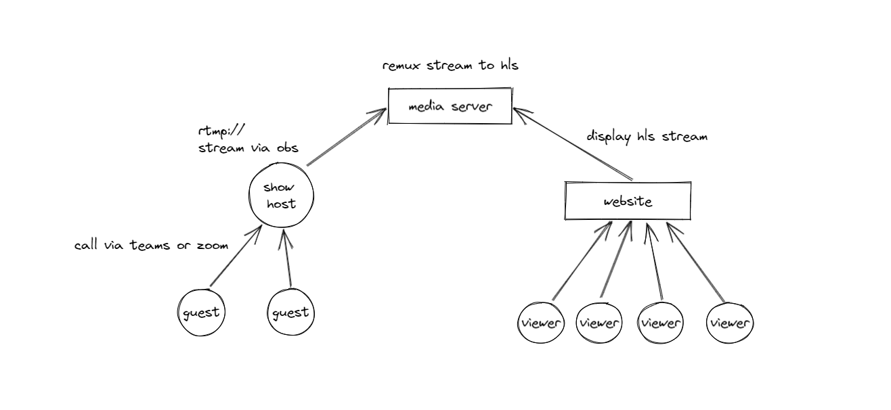

# live stream conference site

use `OBS` to stream to a self-hosted node media-server, that transforms the rtmp stream to hls and makes it available for consumption.

the conference website can then load and display the hls stream via `hls.js`.



# article

## node-media-server setup

start a new project with `npm init -y` and create an `index.js`

install `node-media-server` with `npm i node-media-server`

add the base code to run the server

```js
const NodeMediaServer = require("node-media-server");

const config = {
  rtmp: {
    port: 1935,
    chunk_size: 60000,
    gop_cache: true,
    ping: 30,
    ping_timeout: 60,
  },
  http: {
    port: 8000,
    allow_origin: "*",
    mediaroot: "./media",
  },
};

var nms = new NodeMediaServer(config);
nms.run();
```

your server should now be available on `localhost:8000/admin`. login with `admin:admin` as credentials.

in OBS go to settings > stream settings > platform: custom. and enter the server details. the streamkey can be whatever name you want for your connection.

```
server=rtmp://localhost/live
streamkey=obs
```

you should be able to stream to the server now.

> for some reason, this doesnt work from windows obs to wsl2 hosted media server, running the server on windows for now

## rtmp to hls

hls is a pretty nice format for showing streaming content in the browser. so we need to remux the stream.
download the ffmpeg binaries from https://ffmpeg.org/download.html and configure them in the node-media-server config

```js
// add to config
const config = {
  // ...
  trans: {
    ffmpeg: "C:/Users/myusername/code/media-server/ffmpeg/bin/ffmpeg.exe",
    tasks: [
      {
        app: "live",
        hls: true,
        hlsFlags: "[hls_time=2:hls_list_size=3:hls_flags=delete_segments]",
      },
    ],
  },
};
```

## website

bootstrap your react app however you want. i use vite

`npm i hls.js` to install the hls lib.

basic setup to get it running

```tsx
import React from "react";
import Hls from "hls.js";

const streamUrl = "http://localhost:8000/live/obs/index.m3u8";

export function App() {
  const videoEl = React.useRef<HTMLVideoElement>(null);

  React.useEffect(() => {
    if (!videoEl.current) return;

    if (Hls.isSupported()) {
      const hls = new Hls({
        enableWorker: true,
        lowLatencyMode: true,
        backBufferLength: 90,
      });
      hls.loadSource(streamUrl);
      hls.attachMedia(videoEl.current);
    } else if (videoEl.current.canPlayType("application/vnd.apple.mpegurl")) {
      console.error("use native");
      videoEl.current.src = streamUrl;
    }
  }, []);

  return (
    <div className="App">
      <video
        ref={videoEl}
        style={{ height: 480 }}
        controls
        muted
        autoPlay={true}
      />
    </div>
  );
}
```
